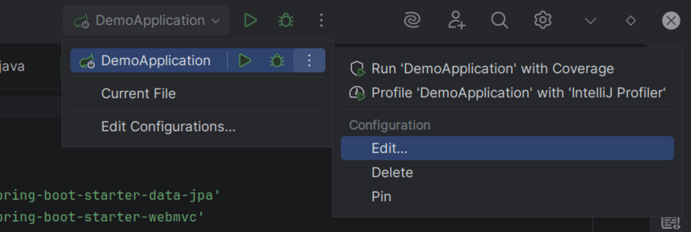
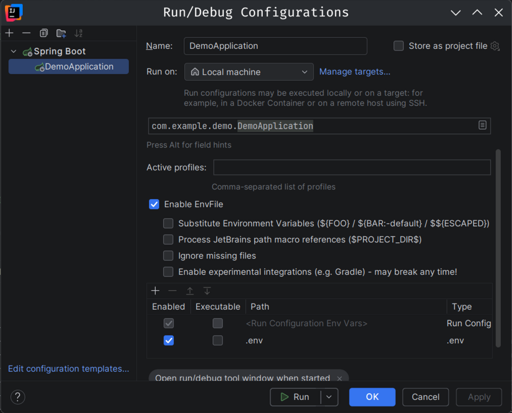

# DemoGL - Guide de lancement

[Read in English](README.md)

Ce guide permet de récupérer le projet et de le faire tourner en local, de la base de données jusqu'au frontend.

## Architecture

- **Frontend** : Vue.js + TypeScript + Tailwind CSS
- **Backend** : Java 25 + Spring Boot + Gradle
- **API** : REST + OpenAPI (Swagger)
- **Database** : PostgreSQL (Supabase)

```
Frontend (Vue.js)
       │  REST
       ▼
Backend (Spring Boot)
       │  JPA / JDBC
       ▼
PostgreSQL (Supabase)
```

---

## 1. Prérequis

À installer avant de commencer :

| Outil | Usage |
| --- | --- |
| Java 25 | Compiler/lancer le backend |
| Node.js + npm | Frontend |
| Git | Cloner le projet |

Le **Gradle Wrapper** est inclus dans le projet : pas besoin d'installer Gradle séparément.

---

## 2. Cloner le projet

```bash
git clone https://github.com/SnYco55/demogl.git
cd demogl
```

Structure du projet :

```
demogl/
├── build.gradle
├── settings.gradle
├── gradlew
├── gradlew.bat
├── .env                  ← config backend
├── src/
│   ├── main/
│   │   ├── java/com/example/demo/
│   │   └── resources/
│   │       └── application.yaml
│   └── test/
└── frontend/
    ├── .env               ← config frontend
    ├── src/
    ├── package.json
    └── vite.config.ts
```

---

## 3. Configurer la base de données (Supabase)

(ou tout autre client PostgreSQL compatible JDBC)

1. Aller sur supabase.com et créer un compte / se connecter (avec github ou autre).
2. Créer un nouveau projet.
3. **Choisir un mot de passe pour la base de données au moment de la création - le garder pour se connecter à la db après.**
4. Une fois le projet créé, aller dans **Connect** pour récupérer les informations de connexion.
5. Choisir **Direct Connection string**
6. Choisir le mode **Direct connection**.

> **Si la connexion directe échoue** (souvent un problème de compatibilité IPv6/IPv4 selon le réseau), utiliser le **Session Pooler** à la place - l'URL fournie change légèrement de format mais fonctionne de la même manière côté Spring Boot.
>

Garder ces trois informations à portée de main pour l'étape suivante :

- host
- username
- port
- password (le mot de passe choisi à l'étape 3)

---

## 4. Configurer le backend

### 4.1 Créer le fichier `.env`

À la **racine du projet** (là où se trouve `build.gradle`), créer un fichier `.env` :

```
DB_URL=jdbc:postgresql://host:port/postgres
DB_USERNAME=username
DB_PASSWORD=password
```

---

## 5. Lancer le backend

### Option A - Gradle avec gradlew

Le `.env` doit être chargé dans l'environnement **avant** de lancer Gradle, depuis la racine du projet. La méthode dépend de l'outil utilisé.

**Linux / macOS**, dans un terminal à la racine du projet :

```bash
export $(cat .env | xargs)
```

ou alors :

```bash
export DB_URL=url... (variable par variable)
```

**Windows (PowerShell)**, variable par variable :

```powershell
$env:DB_URL="..."
$env:DB_USERNAME="..."
$env:DB_PASSWORD="..."
```

Puis lancer l'API :

```bash
./gradlew bootRun       # Linux / macOS
.\gradlew bootRun       # Windows
```

Pour vérifier que les variables sont bien actives :

```bash
export -p                 # Linux / macOS
Get-ChildItem env:        # Windows PowerShell
```

### Option B - Dans IntelliJ IDEA

IntelliJ ne charge pas automatiquement les fichiers `.env`. Installer le plugin **EnvFile** (par Borys Pierov) :

1. `Settings → Plugins` → rechercher **EnvFile** → installer et redémarrer IntelliJ.
2. Ouvrir la configuration de lancement Spring Boot (`Run → Edit Configurations` ou alors voir photo).

    

3. Activer l'onglet **EnvFile**, cocher "Enable EnvFile", puis ajouter le fichier `.env` du backend.

    


Une fois configuré, IntelliJ injecte automatiquement les variables à chaque lancement - plus besoin de les exporter manuellement. (c’est persistant)

### Résultat

L'API est disponible sur :

```
http://localhost:8080
```

## 5.1 Remplir la base de données
Une fois que votre api est lancé, vous pouvez exécuter la commande `seed.ts` qui se trouve dans `frontend/src/config/` pour remplir la base de données.

Lancer le script : (La base de données doit être vide)
```bash
node seed.ts
```

---

## 6. Documentation de l'API

Générée automatiquement à partir des `@RestController` (dépendance `springdoc-openapi-starter-webmvc-ui`) :

| Format | URL |
| --- | --- |
| Swagger UI | `http://localhost:8080/swagger-ui.html` |
| OpenAPI JSON | `http://localhost:8080/v3/api-docs` |
| OpenAPI YAML | `http://localhost:8080/v3/api-docs.yaml` |

Pour tester les endpoints directement sans outil externe (Postman/Insomnia), IntelliJ Ultimate propose un onglet natif **Endpoints** (`View → Tool Windows → Endpoints`) - vérifier que les plugins **Spring** et **Spring** **Web** sont activés, sinon les endpoints n'y apparaîtront pas.

---

## 7. Configurer et lancer le frontend

Depuis le dossier `frontend` :

```bash
npm install
```

Créer un fichier `frontend/.env` :

```
VITE_API_URL=http://localhost:8080
```

Vite injecte automatiquement les variables préfixées `VITE_` donc aucune configuration supplémentaire nécessaire.

Lancer le serveur de développement :

```bash
npm run dev
```

Le frontend est disponible sur :

```
http://localhost:5173
```

---

## 8. Lancement complet - résumé

Une fois les deux `.env` configurés (backend et frontend) :

```bash
# Terminal 1 - Backend (depuis la racine du projet)
export $(cat .env | xargs)   # ou via IntelliJ EnvFile
./gradlew bootRun

# Terminal 2 - Frontend
cd frontend
npm install
npm run dev
```

Puis ouvrir :

```
http://localhost:5173 (et API sur http://localhost:8080)
```

---

## 9. Dépannage

| Problème | Cause probable | Solution |
| --- | --- | --- |
| `.env` non pris en compte dans IntelliJ | Chargement automatique absent | Installer le plugin **EnvFile** et l'activer dans la config de lancement |
| Connexion à la base impossible via Direct connection | Incompatibilité réseau IPv6/IPv4 | Utiliser le **Session Pooler** de Supabase à la place |
| Variables `.env` non actives dans un nouveau terminal | Les exports ne persistent pas entre sessions | export $(cat .env | xargs)
|
| Endpoints absents de l'onglet Endpoints (IntelliJ) | Plugins Spring/Web désactivés | Vérifier leur activation dans `Settings → Plugins` |

---

## 10. Variables d'environnement - récapitulatif

**Backend** (`.env`, à la racine du projet) :

```
DB_URL=jdbc:postgresql://host:port/postgres
DB_USERNAME=username
DB_PASSWORD=password
```

**Frontend** (`frontend/.env`) :

```
VITE_API_URL=http://localhost:8080
```

En production, `VITE_API_URL` doit pointer vers l'URL publique du backend déployé, et il faudra aussi ajouter l’adresse du frontend deployé dans le backend dans `config/CorsConfig`.

**Ne jamais committer les fichiers `.env`** - vérifier leur présence dans `.gitignore`.
